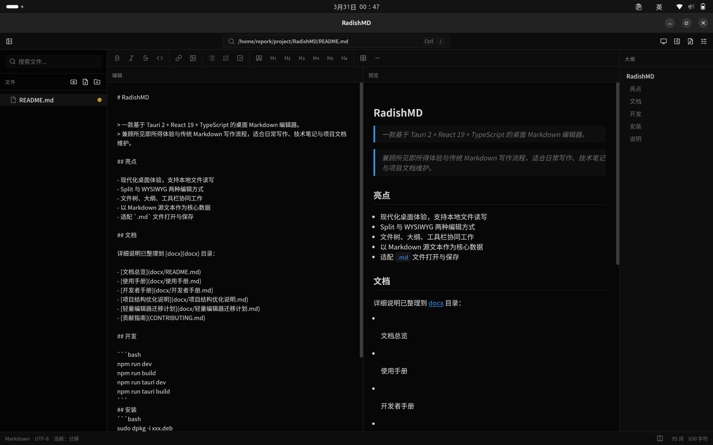

# RadishMD

[English README](README.en.md) | 中文版

> 一款基于 Tauri 2 + React 19 + TypeScript 的桌面 Markdown 编辑器。
> 面向日常写作、技术笔记和项目文档维护，提供编辑、预览、文件管理的一体化体验。

## 项目概览

RadishMD 采用本地优先的桌面架构，围绕 Markdown 源文本展开，兼顾所见即所得体验和传统 Markdown 写作流程。

## 界面预览



## 核心特性

- 本地优先的桌面体验，支持文件读写和文件关联打开
- Split 与 WYSIWYG 两种编辑方式
- 文件树、大纲、工具栏协同工作
- 以 Markdown 源文本作为核心数据
- 适配 `.md` 文件打开、编辑和保存
- 内置 release note 自动化和更新检查

## 快速开始

```bash
npm install
npm run dev
```

## 构建与运行

```bash
npm run build
npm run tauri dev
npm run tauri build
```

## 文档

详细说明已整理到 [docx](docx) 目录：

- [文档总览](docx/README.md)
- [使用手册](docx/使用手册.md)
- [开发者手册](docx/开发者手册.md)
- [项目结构优化说明](docx/项目结构优化说明.md)
- [轻量编辑器迁移计划](docx/轻量编辑器迁移计划.md)
- [贡献指南](CONTRIBUTING.md)

## 安装

Linux 环境可使用发行包安装：

```bash
sudo dpkg -i xxx.deb
```

## 技术栈

- 前端：Vite 7、React 19、TypeScript
- 桌面端：Tauri 2
- 状态管理：Zustand
- 样式：Tailwind CSS 4、shadcn/ui
